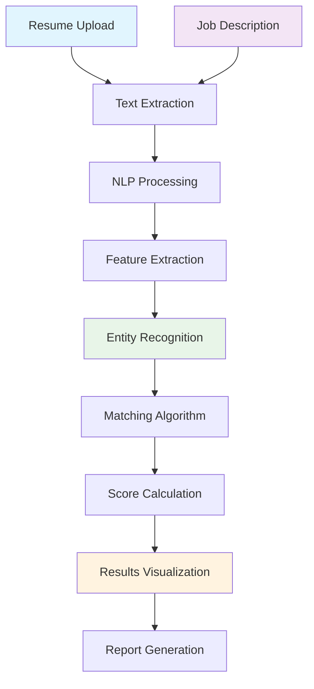

# NLP Resume Matcher

[](https://www.python.org/)
[](https://streamlit.io/)
[](https://spacy.io/)
[](https://huggingface.co/)
[](https://scikit-learn.org/)
[](https://opensource.org/licenses/MIT)

An intelligent AI-powered resume matching system that uses Natural Language Processing (NLP) to analyze resumes and job descriptions, providing accurate compatibility scores and insights for recruiters and job seekers.

## Table of Contents
- [Overview](#overview)
- [Features](#features)
- [Quick Start](#quick-start)
- [Architecture](#architecture)
- [Installation](#installation)
- [Usage](#usage)
- [NLP Models](#nlp-models)
- [Matching Algorithms](#matching-algorithms)
- [Configuration](#configuration)
- [API Reference](#api-reference)
- [Project Structure](#project-structure)
- [Contributing](#contributing)
- [License](#license)

## Overview

NLP Resume Matcher is an advanced AI-powered tool that helps recruiters and hiring managers efficiently match resumes with job descriptions. Using state-of-the-art NLP techniques, it analyzes text content, extracts key entities, and calculates compatibility scores to streamline the hiring process.

## Features

- **🤖 Advanced NLP Processing**: Uses spaCy and transformers for text analysis
- **🎯 Smart Matching**: Multiple algorithms for accurate resume-job matching
- **📊 Detailed Analytics**: Comprehensive matching scores and insights
- **🔍 Entity Extraction**: Automatically extracts skills, experience, education, and more
- **📈 Visualization**: Interactive charts and graphs for match analysis
- **📁 Multi-format Support**: PDF, DOCX, TXT file support
- **⚡ Batch Processing**: Process multiple resumes simultaneously
- **🔒 Privacy Focused**: Local processing option for sensitive data
- **📤 Export Results**: Generate detailed reports in multiple formats
- **🌐 Web Interface**: User-friendly Streamlit application

## Quick Start

### Prerequisites
- Python 3.8 or higher
- 4GB+ RAM recommended
- Modern web browser

### Installation

1. **Clone the repository**
```bash
git clone https://github.com/znblrean/nlp-resume-matcher.git
cd nlp-resume-matcher
```

2. **Set up virtual environment**
```bash
python -m venv venv
source venv/bin/activate  # On Windows: venv\Scripts\activate
```

3. **Install dependencies**
```bash
pip install -r requirements.txt
python -m spacy download en_core_web_md
```

4. **Run the application**
```bash
streamlit run app.py
```

5. **Access the app** at `http://localhost:8501`

## Architecture



## Installation

### Detailed Setup

1. **System Requirements**
```bash
# Verify Python installation
python --version  # Should be 3.8 or higher

# Check available memory
# Minimum 2GB RAM, 4GB recommended for better performance
```

2. **Install NLP Models**
```bash
# Install spaCy models
python -m spacy download en_core_web_sm
python -m spacy download en_core_web_md
python -m spacy download en_core_web_lg

# Download NLTK data
python -c "import nltk; nltk.download('punkt'); nltk.download('stopwords')"
```

3. **Docker Installation (Alternative)**
```bash
# Build and run with Docker
docker build -t nlp-resume-matcher .
docker run -p 8501:8501 nlp-resume-matcher
```

## Usage

### Basic Workflow

1. **Upload Documents**
   - Upload resumes (PDF, DOCX, TXT)
   - Enter or upload job description
   - Set matching preferences

2. **Process Documents**
   - Automatic text extraction
   - NLP processing
   - Entity recognition

3. **View Results**
   - Match scores and rankings
   - Detailed analysis
   - Visual comparisons

4. **Export Results**
   - Generate reports
   - Download matches
   - Save configurations

### Sample Code

```python
from resume_matcher import ResumeMatcher

# Initialize matcher
matcher = ResumeMatcher()

# Load documents
resume_text = "John Doe\nSoftware Engineer\nPython, Java, AWS\n..."
job_description = "Looking for Software Engineer with Python experience..."

# Calculate match
result = matcher.match(resume_text, job_description)
print(f"Match Score: {result['score']}%")
print(f"Skills Match: {result['skills_match']}")
```

### Advanced Features

#### Batch Processing
```python
# Process multiple resumes
results = matcher.batch_match(
    resumes=['resume1.pdf', 'resume2.docx'],
    job_description='job_desc.txt',
    algorithm='cosine_similarity'
)
```

#### Custom Matching
```python
# Custom weight configuration
weights = {
    'skills': 0.4,
    'experience': 0.3,
    'education': 0.2,
    'keywords': 0.1
}

result = matcher.match_with_weights(resume, job_desc, weights)
```

## NLP Models

### Text Processing Pipeline

1. **Text Extraction**
   - PDF parsing with PyPDF2/pdfplumber
   - DOCX parsing with python-docx
   - Text cleaning and normalization

2. **Preprocessing**
   - Tokenization
   - Stopword removal
   - Lemmatization
   - Sentence segmentation

3. **Feature Extraction**
   - TF-IDF vectors
   - Word embeddings (spaCy, BERT)
   - N-gram features
   - Semantic similarity

### Available Models

| Model | Purpose | Strengths |
|-------|---------|-----------|
| **spaCy en_core_web_md** | Entity recognition | Fast, accurate NER |
| **BERT embeddings** | Semantic similarity | Contextual understanding |
| **TF-IDF** | Keyword matching | Traditional, fast |
| **Doc2Vec** | Document similarity | Paragraph-level analysis |
| **Sentence-BERT** | Semantic matching | Sentence-level accuracy |

### Entity Recognition
```python
entities = {
    'skills': ['Python', 'Java', 'AWS', 'Docker'],
    'experience': ['5 years', 'Senior Developer'],
    'education': ['Bachelor of Science', 'Computer Science'],
    'certifications': ['AWS Certified', 'PMP'],
    'locations': ['San Francisco', 'Remote']
}
```

## Matching Algorithms

### 1. Cosine Similarity
```python
# Traditional TF-IDF based matching
from sklearn.feature_extraction.text import TfidfVectorizer
from sklearn.metrics.pairwise import cosine_similarity

vectorizer = TfidfVectorizer()
vectors = vectorizer.fit_transform([resume_text, job_description])
similarity = cosine_similarity(vectors[0:1], vectors[1:2])[0][0]
```

### 2. Semantic Similarity (BERT)
```python
# Using transformers for semantic matching
from sentence_transformers import SentenceTransformer

model = SentenceTransformer('all-MiniLM-L6-v2')
embeddings = model.encode([resume_text, job_description])
similarity = cosine_similarity([embeddings[0]], [embeddings[1]])[0][0]
```

### 3. Hybrid Matching
```python
# Combine multiple approaches
def hybrid_match(resume, job_desc):
    tfidf_score = calculate_tfidf_similarity(resume, job_desc)
    semantic_score = calculate_semantic_similarity(resume, job_desc)
    entity_score = calculate_entity_match(resume, job_desc)
    
    # Weighted combination
    final_score = (
        0.3 * tfidf_score +
        0.4 * semantic_score +
        0.3 * entity_score
    )
    return final_score
```

### 4. Custom Rule-based Matching
```python
rules = {
    'required_skills': ['Python', 'AWS'],
    'minimum_experience': 3,  # years
    'education_level': 'Bachelor',
    'preferred_certifications': ['AWS Certified']
}
```

## Configuration

### Environment Variables

Create a `.env` file:

```env
# Application Settings
APP_NAME="NLP Resume Matcher"
DEBUG=False
PORT=8501
HOST=0.0.0.0

# Model Settings
SPACY_MODEL=en_core_web_md
SENTENCE_TRANSFORMER_MODEL=all-MiniLM-L6-v2
TFIDF_MAX_FEATURES=5000

# Matching Settings
DEFAULT_ALGORITHM=hybrid
MINIMUM_SCORE_THRESHOLD=60
SKILLS_WEIGHT=0.35
EXPERIENCE_WEIGHT=0.25
EDUCATION_WEIGHT=0.20
KEYWORDS_WEIGHT=0.20

# File Processing
MAX_FILE_SIZE_MB=10
ALLOWED_EXTENSIONS=pdf,docx,doc,txt
UPLOAD_FOLDER=uploads
```

### Application Settings

```python
# config/settings.py
class Settings:
    # Model configurations
    MODELS = {
        'spacy': 'en_core_web_md',
        'sentence_transformer': 'all-MiniLM-L6-v2',
        'tfidf_max_features': 5000
    }
    
    # Matching algorithms
    ALGORITHMS = {
        'cosine': 'Cosine Similarity',
        'semantic': 'Semantic Similarity',
        'hybrid': 'Hybrid Approach',
        'custom': 'Custom Rules'
    }
    
    # Scoring weights
    WEIGHTS = {
        'skills': 0.35,
        'experience': 0.25,
        'education': 0.20,
        'keywords': 0.20
    }
    
    # UI Settings
    UI = {
        'items_per_page': 10,
        'default_sort': 'score_desc',
        'chart_colors': ['#FF6B6B', '#4ECDC4', '#45B7D1', '#96CEB4']
    }
```

## API Reference

### Core Classes

#### ResumeMatcher
```python
class ResumeMatcher:
    def __init__(self, config=None):
        """Initialize resume matcher with configuration"""
        
    def match(self, resume_text: str, job_description: str, 
              algorithm: str = 'hybrid') -> Dict:
        """Match resume against job description"""
        
    def batch_match(self, resumes: List[str], job_description: str,
                   algorithm: str = 'hybrid') -> List[Dict]:
        """Match multiple resumes against job description"""
        
    def extract_entities(self, text: str) -> Dict:
        """Extract entities from text"""
        
    def calculate_similarity(self, text1: str, text2: str,
                            method: str = 'cosine') -> float:
        """Calculate similarity between two texts"""
```

#### DocumentProcessor
```python
class DocumentProcessor:
    def extract_text(self, file_path: str) -> str:
        """Extract text from document file"""
        
    def clean_text(self, text: str) -> str:
        """Clean and preprocess text"""
        
    def parse_resume(self, text: str) -> Dict:
        """Parse resume into structured format"""
        
    def parse_job_description(self, text: str) -> Dict:
        """Parse job description into structured format"""
```

#### ResultVisualizer
```python
class ResultVisualizer:
    def generate_score_card(self, result: Dict) -> str:
        """Generate HTML score card"""
        
    def create_comparison_chart(self, results: List[Dict]) -> Plotly.Figure:
        """Create comparison chart"""
        
    def generate_report(self, results: List[Dict], 
                       format: str = 'html') -> str:
        """Generate detailed report"""
```

### REST API Endpoints

```python
# API endpoints (if implemented)
@app.route('/api/match', methods=['POST'])
def match_resume():
    """API endpoint for resume matching"""
    data = request.json
    resume = data.get('resume')
    job_desc = data.get('job_description')
    result = matcher.match(resume, job_desc)
    return jsonify(result)

@app.route('/api/batch-match', methods=['POST'])
def batch_match():
    """API endpoint for batch matching"""
    files = request.files.getlist('resumes')
    job_desc = request.form.get('job_description')
    results = matcher.batch_match(files, job_desc)
    return jsonify(results)
```

## Project Structure

```
nlp-resume-matcher/
├── app.py                    # Main Streamlit application
├── requirements.txt          # Python dependencies
├── Dockerfile               # Docker configuration
├── .env.example            # Environment variables template
├── README.md               # Project documentation
├── setup.py               # Package setup
├── config/                 # Configuration files
│   ├── __init__.py
│   ├── settings.py         # Application settings
│   ├── models.py          # Model configurations
│   └── constants.py       # Application constants
├── core/                   # Core matching logic
│   ├── __init__.py
│   ├── matcher.py         # Main matching engine
│   ├── processor.py       # Document processor
│   ├── extractor.py       # Entity extractor
│   ├── algorithms.py      # Matching algorithms
│   └── scorer.py          # Scoring functions
├── models/                 # ML models
│   ├── __init__.py
│   ├── embeddings.py      # Embedding models
│   ├── similarity.py      # Similarity models
│   └── classifiers.py     # Classification models
├── utils/                  # Utility functions
│   ├── __init__.py
│   ├── file_utils.py      # File handling utilities
│   ├── text_utils.py      # Text processing utilities
│   ├── visualization.py   # Visualization utilities
│   └── validation.py      # Data validation
├── ui/                     # User interface components
│   ├── __init__.py
│   ├── dashboard.py       # Main dashboard
│   ├── uploader.py        # File upload components
│   ├── results.py         # Results display
│   ├── charts.py          # Chart components
│   └── reports.py         # Report generation
├── data/                   # Data files
│   ├── sample_resumes/    # Sample resumes
│   ├── sample_jobs/       # Sample job descriptions
│   └── stopwords/         # Custom stopwords
├── tests/                  # Test suite
│   ├── __init__.py
│   ├── test_matcher.py    # Matcher tests
│   ├── test_processor.py  # Processor tests
│   ├── test_algorithms.py # Algorithm tests
│   └── test_integration.py # Integration tests
└── docs/                   # Documentation
    ├── api.md            # API documentation
    ├── user_guide.md     # User guide
    ├── developer_guide.md # Developer guide
    └── screenshots/      # Application screenshots
```

## Contributing

We welcome contributions! Please see our [Contributing Guidelines](CONTRIBUTING.md) for details.

### Development Setup

1. **Fork and clone**
```bash
git clone https://github.com/your-username/nlp-resume-matcher.git
cd nlp-resume-matcher
```

2. **Set up development environment**
```bash
python -m venv venv
source venv/bin/activate
pip install -r requirements-dev.txt
```

3. **Install pre-commit hooks**
```bash
pre-commit install
```

4. **Run tests**
```bash
pytest tests/ -v
```

### Code Standards
- Follow PEP 8 guidelines
- Use type hints for all functions
- Write comprehensive docstrings
- Add tests for new features
- Update documentation

### Testing
```bash
# Run all tests
pytest

# Run with coverage
pytest --cov=core --cov=utils tests/

# Run specific test category
pytest tests/test_matcher.py -v
pytest tests/test_algorithms.py -v
```

## License

This project is licensed under the MIT License - see the [LICENSE](LICENSE) file for details.

## Support

- 📧 **Email**: Zenoomalik@gmail.com
- 🐛 **Issues**: [GitHub Issues](https://github.com/znblrean/nlp-resume-matcher/issues)
- 💬 **Discussions**: [GitHub Discussions](https://github.com/znblrean/nlp-resume-matcher/discussions)
- 📚 **Documentation**: [Wiki](https://github.com/znblrean/nlp-resume-matcher/wiki)

## Acknowledgments

- [spaCy](https://spacy.io/) for excellent NLP capabilities
- [Hugging Face](https://huggingface.co/) for transformer models
- [Streamlit](https://streamlit.io/) for the web framework
- [scikit-learn](https://scikit-learn.org/) for machine learning utilities
- All contributors and users

## Roadmap

### Planned Features
- [ ] Multi-language support
- [ ] Advanced AI model fine-tuning
- [ ] Integration with ATS systems
- [ ] Real-time collaboration features
- [ ] Mobile application
- [ ] API for third-party integrations
- [ ] Advanced analytics dashboard
- [ ] Interview question generation

### Research Areas
- Graph-based matching algorithms
- Cross-lingual matching
- Few-shot learning for domain adaptation
- Explainable AI for match decisions

---

**⭐ If this project helps you in your hiring process, please give it a star!**
